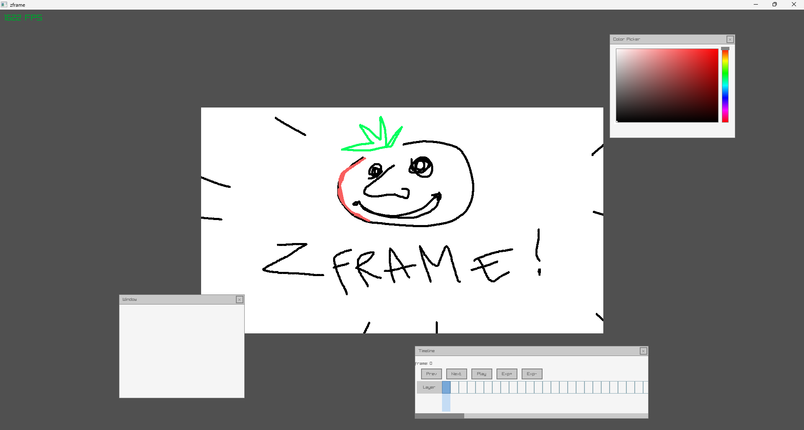

# zframe
[WIP] Animation/Drawing Software built in Ziglang
### Pitch
A software built for drawing first. No technical bs, no hidden tools, no messy UI.

### Goals
- Fully functionnal canvas
- Project Files
- PNG/MP4 Renders

### Current State
- Canvas (w/ camera movement)
- Drawing (kinda interpolated)
- Window spawning/killing
